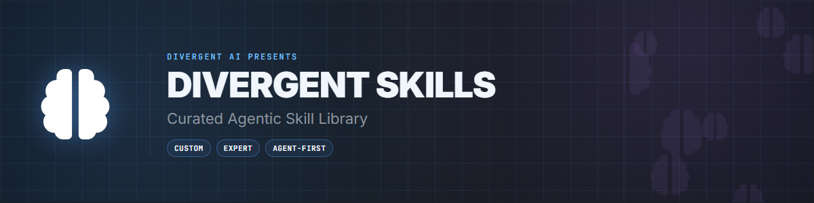
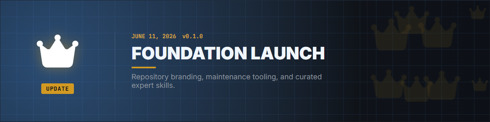

# Divergent Skills: Curated Agentic Skill Library

<div align="center">
  

<br/>

[](https://github.com/thedivergentai/Divergent-Skills/stargazers)
[](LICENSE)
[](skills/)
[](https://skills.sh/thedivergentai/Divergent-Skills)
[](https://github.com/thedivergentai/Divergent-Skills/commits/main)
[](https://github.com/thedivergentai)

**"A skill neglected is capability lost." — Divergent AI**

**Brought to you by [Divergent AI](https://github.com/thedivergentai)**

</div>

---

## 💬 A Message from the Creator (Divergent AI)

> **June 11, 2026**
>
> Hey everyone — Divergent AI here. This repo is my personal **skills workshop**: packages I reach for repeatedly, tuned for specific expert workflows, or that I couldn't find done well elsewhere in the ecosystem.
>
> <details>
> <summary><b>Read the full message...</b></summary>
> <br/>
> Unlike a massive domain library, Divergent Skills stays intentionally small and sharp. Each skill here earns its place because I actually use it — or because the gap in public skills was wide enough to matter.
> <br/><br/>
> Every package is held to a high quality bar and audited against [skill-judge](https://github.com/softaworks/agent-toolkit/tree/main/skills/skill-judge) standards.
> <br/><br/>
> Issues and feedback are welcome. If a skill saves you time, consider starring the repo — it helps others discover curated expertise over generic slop.
> <br/><br/>
> Use AI for good. Build precisely. Ship with confidence.
> </details>

---

## 📜 Updates

<div align="center">
  
</div>

#### v0.1.0 — Foundation Launch
- **Curated skills**: [weasyprint](#weasyprint) and [meta-socials](#meta-socials) — expert-depth packages for PDF generation and Meta Graph API publishing.
- **Quality bar**: Skills audited against skill-judge specifications.

<br/>

---

<details>
<summary><b>📜 Update Archive</b></summary>

<br/>

<i>No prior releases yet — this is the foundation.</i>

</details>

---

## 📍 Quick Navigation

| 🚀 Get Started | 🧩 Skills | 🔍 Quality |
|:---:|:---:|:---:|
| [Install](#-quick-start) | [Skill Index](#-skill-index) | [Quality](#-quality) |

---

## The Philosophy

**Divergent Skills** is a **curated, agent-first** library — not a dump of every skill under the sun. Each package solves a real workflow with expert-level depth: distilled references, decision matrices, and anti-patterns where they matter.

Skills land here when they are:

1. **Heavily customized** to a specific use case I rely on.
2. **Missing or shallow** in the broader skills ecosystem.
3. **Maintained** to a high expert standard.

**If this library helps your agents work smarter, please give it a star.**

---

## ⚡ Quick Start

Install only the skill you need — surgical context beats metadata floods.

```bash
# WeasyPrint — HTML/CSS → PDF expert workflows
npx skills add thedivergentai/Divergent-Skills/skills/weasyprint

# Meta Socials — Facebook Pages & Instagram Graph API
npx skills add thedivergentai/Divergent-Skills/skills/meta-socials
```

> [!IMPORTANT]
> Install **one skill at a time** for the task at hand. This repo is curated for focus, not bulk ingestion.

---

## 🧩 Skill Index

| Skill | Description |
|-------|-------------|
| [weasyprint](skills/weasyprint/) | HTML/CSS → PDF with WeasyPrint: pagination, PDF/A/UA, Factur-X, security, CourtBouillon patterns |
| [meta-socials](skills/meta-socials/) | Meta Graph API for Facebook Pages & Instagram: auth, publishing, webhooks, permissions |

---

## 🔍 Quality

Skills in this library are evaluated against [skill-judge](https://github.com/softaworks/agent-toolkit/tree/main/skills/skill-judge) — spec alignment, trigger accuracy, progressive disclosure, and reference hygiene.

When using a skill, start with its **resource matrix** if scope is unclear (`references/resource-matrix.md` or `references/RESOURCE-MATRIX.md` inside the skill).

---

## 🤝 Contributing

Issues and skill requests welcome. For new skills, describe the **knowledge delta** — what expert depth this adds beyond generic model knowledge.

---

## ⭐ Star History

[](https://star-history.com/#thedivergentai/Divergent-Skills&Date)

---

## 📊 Repository Stats

| Metric | Value |
|:---|:---|
| **Published Skills** | 2 |
| **Focus** | Expert, use-case-specific agent skills |
| **License** | LGPLv3 |
| **Maintainer** | [Divergent AI](https://github.com/thedivergentai) |

---

## 📜 License

This project is licensed under the **GNU Lesser General Public License v3.0** — see [LICENSE](LICENSE) for details.

**Why LGPLv3?**  
It keeps improvements to this skill library open and shared with the community, while still letting you use these skills in your own projects — including commercial work you keep closed-source.

**By contributing**, you agree that your contributions will be licensed under the project's LGPLv3 license.

---

<div align="center">

**Authored by [Divergent AI](https://github.com/thedivergentai)**  
**Maintained for agents that earn their context**

</div>
